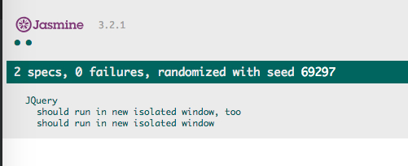

JavaScript Jasmine Use Isolate IFrame Window for Tests Demo
===========================================================

如果测试需要对`window/document`进行修改，如何保证它们之间互不影响？

我想到的办法是为每个测试创建一个独立的iframe，使用它的window

```
npm install
npm run test
```



